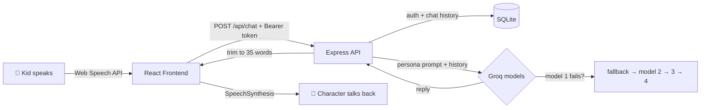

<div align="center">


**Kids talk. A cartoon character listens, thinks, and talks back, in the kid's own language.**

<p>
  
  
  
  
  
  
</p>

[🚀 Live Demo](https://github.com/archanathakur86) · [🐛 Report Bug](https://github.com/archanathakur86/WhySo/issues) · [💡 Request Feature](https://github.com/archanathakur86/WhySo/issues)

</div>

---

## 📸 Preview

<!-- Add 2-3 screenshots or a GIF here. Recruiters love visuals! -->
<!-- <p align="center"></p> -->

> 🎬 *Screenshots / demo GIF coming soon.*

---

## ✨ Why WhySo?

Kids ask "why?" about everything, but typing is slow and most chatbots sound like a textbook. **WhySo** removes both problems: a child just *speaks*, and a playful animated character answers out loud in **short, kid-friendly sentences** (max 35 words) in the **same language the child used**.

## 🎯 Features

| | Feature | Details |
|---|---|---|
| 🎙️ | **Speech-to-speech loop** | Live voice input with interim transcript and auto-stop on silence → AI reply → spoken aloud |
| 🎭 | **5 animated mascots** | Owl 🦉, Dino 🦖, Bunny 🐰, Bot 🤖, Fox 🦊, all hand-built SVG whose face reacts to *listening / thinking / speaking* |
| 🌍 | **Multilingual replies** | Answers automatically in the user's language: English, Hindi, Hinglish & more |
| 🧠 | **Cross-session memory** | A new chat is seeded with the last conversation, so the buddy remembers the child |
| 🛡️ | **Resilient AI layer** | **Groq multi-model fallback chain**; if one model fails, the next takes over, and the user always gets an in-character reply |
| 🔐 | **Secure accounts** | SHA-256 + **bcrypt** password hashing, session tokens, ownership checks on every chat endpoint |
| 🎚️ | **Custom voice** | Per-user pitch & speed sliders with a live "test voice" button |
| 🗂️ | **Chat history** | Searchable sidebar, delete chats, auto-titled conversations |
| 🔊 | **Zero audio files** | UI sounds (pop, chime, giggle) synthesized live with the **Web Audio API** |

---

## 🏗️ How it works



## 🧰 Tech Stack

| Layer | Tech |
|---|---|
| **Frontend** | React 19, Vite, react-markdown, Web Speech API (recognition + synthesis), Web Audio API |
| **Backend** | Node.js, Express 5, better-sqlite3, groq-sdk, bcryptjs |
| **AI** | Groq-hosted LLMs with automatic multi-model fallback |
| **Database** | SQLite (users, sessions, chats, messages) |

## 📁 Project Structure

```
WhySo/
├── backend/
│   ├── server.js          # Express API, auth, characters, Groq fallback logic
│   ├── db.js              # SQLite schema + safe migrations
│   ├── .env.example       # Environment variable template
│   └── package.json
└── frontend/
    ├── src/
    │   ├── App.jsx                     # Chat UI, mic input, speech output
    │   ├── components/
    │   │   ├── AuthModal.jsx           # Login / register
    │   │   ├── ProfileModal.jsx        # Name, buddy & voice settings
    │   │   ├── CharacterSelector.jsx
    │   │   └── MascotAvatar.jsx        # Animated SVG mascots
    │   └── utils/soundEngine.js        # Web Audio sound effects
    ├── vite.config.js                  # Proxies /api → localhost:5000
    └── package.json
```

---

## 🚀 Getting Started

### Prerequisites
- **Node.js** 18+
- A free **[Groq API key](https://console.groq.com/keys)**
- **Chrome or Edge** recommended (best Web Speech API support)

### 1. Clone
```bash
git clone https://github.com/archanathakur86/WhySo.git
cd WhySo
```

### 2. Backend
```bash
cd backend
npm install
cp .env.example .env     # then add your GROQ_API_KEY
npm run dev              # runs on http://localhost:5000
```

### 3. Frontend
```bash
cd frontend
npm install
npm run dev              # runs on http://localhost:5173
```

Open **http://localhost:5173**, create an account, pick a buddy, tap 🎤 and start talking!

### ⚙️ Environment variables (`backend/.env`)

| Variable | Required | Description |
|---|---|---|
| `GROQ_API_KEY` | ✅ | Your Groq API key |
| `PORT` | ❌ | Server port (default `5000`) |
| `GROQ_MODELS` | ❌ | Comma-separated model list, tried in order (fallback chain) |
| `PASSWORD_PEPPER` | ❌ | Secret added before hashing; set it in production |

---

## 🔌 API Reference

| Method | Endpoint | Auth | Description |
|---|---|:---:|---|
| `GET` | `/api/characters` | ❌ | List all cartoon buddies |
| `POST` | `/api/auth/register` | ❌ | Create account |
| `POST` | `/api/auth/login` | ❌ | Login, returns session token |
| `POST` | `/api/auth/logout` | ✅ | Invalidate session |
| `GET` | `/api/auth/me` | ✅ | Current user |
| `POST` | `/api/profile` | ✅ | Update name, buddy, voice pitch/speed |
| `GET` | `/api/chats` | ✅ | List user's chats |
| `POST` | `/api/chats` | ✅ | Start a new chat (seeded with previous context) |
| `GET` | `/api/chats/:id/messages` | ✅ | Messages of a chat |
| `DELETE` | `/api/chats/:id` | ✅ | Delete a chat |
| `POST` | `/api/chat` | ✅ | Send a message, get the AI reply |

## 🗄️ Database Schema

```
users          id · email (unique) · password · name · avatar · pitch · speed · created_at
user_sessions  token (pk) · user_id → users · created_at
chats          id · user_id → users · title · seed · character · created_at
messages       id · chat_id → chats · user_id → users · role · content · created_at
```

## 🔒 Security Notes

- Passwords are stored as `bcrypt(SHA-256(password + pepper))`: the SHA-256 pre-hash keeps input fixed-length, bcrypt adds a per-user salt and adaptive cost.
- Old SHA-256-only accounts are **automatically upgraded to bcrypt on next login**.
- Every chat route checks that the chat belongs to the logged-in user.
- API keys live only in the backend `.env`, never in the browser.

---

## 🗺️ Roadmap

- [ ] Session expiry / token rotation
- [ ] Rate limiting on auth & chat routes
- [ ] Parental dashboard (topics, screen time)
- [ ] More characters & voices
- [ ] Voice-recognition language selector (Hindi / English)
- [ ] Docker setup

## 🤝 Contributing

Contributions, issues and feature requests are welcome. Fork the repo, create a branch, and open a pull request.

## 👩‍💻 Author

**Archana Thakur**, Full Stack Developer

[](https://linkedin.com/in/archana-thakur-9b66a4338)
[](https://github.com/archanathakur86)
[](mailto:archanathakurs246@gmail.com)

<div align="center">

⭐ **If you like this project, give it a star!** ⭐


</div>
